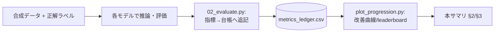
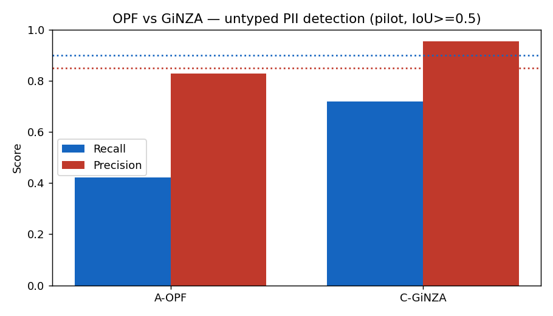
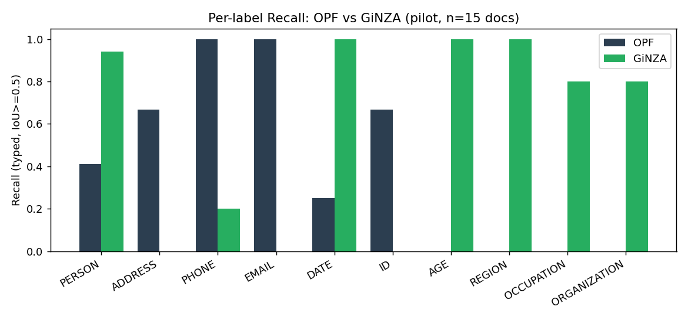

# OPF 日本語適用性 実証実験 — 評価レポート（サマリ）

メタ: 対象 = OpenAI Privacy Filter (`opf`) ／ リポジトリ = gghatano/opf-text-masking-demo ／ 最終更新 = 2026-06-08

> 📑 **凡例** — `[n]`=一次情報の事実（付録C）／🔎=実測・解釈・推定／`📘`=ドキュメント由来。
> ⚠️ **本ページはサマリ**です。各手法の詳細・生データ・落とし穴は **手法詳細ページ**（上部タブ／付録B）に分離。実験が進むたびに §2 数値表・§3 比較と所見を更新し HTML を再ビルドします。

> ⚠️ **スコープ** — 対象は**日本語**自由記述（医療/自治体/その他, 計300件・合成）。主目的は PII 検出性能（漏れ最小化）＋匿名加工**業務の工数削減効果**の定量評価。実データは扱わない。詳細計画: [`docs/verification-plan.md`](docs/verification-plan.md)。

---

## 0. エグゼクティブサマリ

- **現在地: Stage 0（環境構築・定性スモーク）完了**。`uv` で再現可能な環境を確立し、OPF が CPU 実機で動作することを確認 🔎。
- **形式的な数値評価（B0/B1/B2）は未測定**。合成評価データ（#5）が揃い次第、§2 を埋める。
- 🔎 **素 OPF（定性）**: 氏名・住所・電話・メール・西暦日付は日本語でも検出。**業務ID・施設名・年齢・和暦日付は見逃し** → B1/B2 の伸びしろ。詳細 → [OPF ページ](methods/opf.md)。
- 🔎 **モデル比較（パイロット実測 §3）**: 同一gold・同一マッチャ(IoU≥0.5)で OPF vs GiNZA を計測。**相補性が実数で確認**——OPFは PHONE/EMAIL(R=1.0)・ID等の**構造化PII**に強く、GiNZAは PERSON(0.94)・AGE/REGION/DATE(1.0)等の**人名・準識別子**に強い。OPFの境界過延長(PERSON R=0.41)は B1 の改善対象。用途で使い分け（アンサンブルは対象外 #18）。
- 📘 **確定事実**: OPF は **LoRA 非対応＝フルFT のみ**。10ラベルは `--label-space-json` で直接学習可。指標は `detection.span.*`/`by_class.<label>.span.*` を台帳へ写像 [\[2\]](#ref2)。

---

## 1. 検証パイプライン



段階: **B0**(素OPF) → **B1**(後処理・正規表現) → **B2**(日本語フルFT)。並行で多モデル比較（GiNZA→Presidio→GLiNER→日本語NER）。

---

## 2. 結果サマリ（数値）

> 🔎 **現時点 B0/B1/B2 未測定**（評価データ #5 待ち）。成功基準 [spec §9]: Recall≥90% / Precision≥85% / 主要ラベル R≥90%・P≥85% / 作業削減率≥50% / 見逃し率≤5%。**F1（総合指標）は用いない**（見逃しと過剰検出はコスト非対称 #24）。

| Stage | 説明 | Recall | Precision | 漏れ率 | 誤検出率 |
|---|---|---:|---:|---:|---:|
| B0 | 素モデル | — | — | — | — |
| B1 | 後処理・正規表現 | — | — | — | — |
| B2 | 日本語追加学習 | — | — | — | — |

*（B0 計測後に `figures/score_progression.png` を掲載）*

---

## 3. モデル比較（パイロット実測）

**公平性プロトコル**（#23）: 同一 gold（合成 **15文書 / 57スパン**）・**同一マッチャ char IoU≥0.5**・各モデルの PII 該当出力に限定・**F1不使用で Recall/Precision**（#24）。untyped（検出）を主、typed（ラベル一致）を per-label。実装 `scripts/03_compare_models.py`、データ `scripts/01_make_eval.py`。

> ⚠️ **パイロット**（n=15, 準識別子多めの構成）。配管検証＋傾向把握が目的で、本評価は300件（#5）で再測定する。

### 3.1 全体（untyped 検出, IoU≥0.5）

| モデル | Recall | Precision |
|---|---:|---:|
| OPF（素） | 0.42 | 0.83 |
| GiNZA（`ja_ginza`） | 0.72 | 0.95 |


**図1**: 全体の untyped 検出 P/R（このパイロットは準識別子が多く GiNZA 有利な構成）。

### 3.2 ラベル別 Recall（typed）


**図2**: ラベル別 Recall。相補性が実数で表れる。

🔎 **結論（実数で相補性を確認）**:
- **OPF が強い**: PHONE・EMAIL（R=1.0）、ID（0.67）＝**構造化PII**。
- **GiNZA が強い**: PERSON（0.94）、AGE・REGION・DATE（1.0）、OCCUPATION・ORGANIZATION（0.8）＝**人名・準識別子・和暦日付**。
- **共通の課題**: ADDRESS（OPFは**境界過延長**で R=0.67、GiNZAは住所を地名に分割し 0）。OPFの PERSON が R=0.41 と低いのも「佐藤花子（72歳）は」を1スパン化する**境界過延長**が IoU で落ちるため → **B1の境界後処理**の主対象。
→ 構造化PIIは **OPF＋正規表現**、人名・準識別子は **GiNZA等**、で使い分け。OPFを**日本語追加学習(B2)**で準識別子へ広げるのが伸びしろ。各手法の詳細は手法ページへ。

---

## 4. 制約（要点）

- ⚠️ Python 3.14 で torch 無し → `uv` で 3.12。CPU 機は `--device cpu` 必須。
- ⚠️ GiNZA 5.2 は新 spaCy と非互換 → `split_mode` 明示で回避（[GiNZA ページ](methods/ginza.md)）。
- 🔎 準識別子（年齢/地域/職業）は誤検出と表裏で難度高。成功基準 Recall90% の対象範囲は #3 で確定。
- 詳細な落とし穴は各手法ページ。

## 5. 次のマイルストーン
合成評価データ300件（#5）→ **B0**（#7）で §2 初回更新 → **B1**＋GiNZA等の数値比較（#8/#9/#10）→ **B2**（#12）→ 業務適用シミュレーション（#14）。

---

## 付録A 再現手順
```bash
git clone https://github.com/gghatano/opf-text-masking-demo.git && cd opf-text-masking-demo
bash scripts/setup_env.sh && source .venv/Scripts/activate
python scripts/02_evaluate.py data/eval/medical.jsonl --stage B0 --model A-OPF --domain 医療
python scripts/plot_progression.py && python scripts/build_html.py
```

## 付録B レポート運用ルール（型）
- **サマリ＝本 `REPORT.md`（index）**。エグゼクティブサマリ・数値表・比較図・要点のみ。
- **詳細＝手法ごとに `methods/<name>.md`**（別ページ・タブ）。モデル仕様・生データ・型対応・落とし穴・定性所見はここに書く。
- 実験フロー: `02_evaluate.py`→台帳追記 → `plot_progression.py`→図再生成 → §2/§3 と該当手法ページを更新 → `build_html.py` で再ビルド。
- 事実に `[n]`、実測・解釈に 🔎 を必ず付け区別する。

## 付録C 手法詳細ページ・出典
- 手法ページ: [OPF](methods/opf.md) ／ [GiNZA](methods/ginza.md)（以降 Presidio/GLiNER/日本語NER を追加）
- <a id="ref1"></a>[1] OpenAI Privacy Filter: https://github.com/openai/privacy-filter
- <a id="ref2"></a>[2] OPF CLI/学習・評価 ソース確認: [`docs/findings-opf-cli.md`](docs/findings-opf-cli.md)
- <a id="ref3"></a>[3] 計画/仕様: [`docs/verification-plan.md`](docs/verification-plan.md) / [`docs/spec.txt`](docs/spec.txt)
