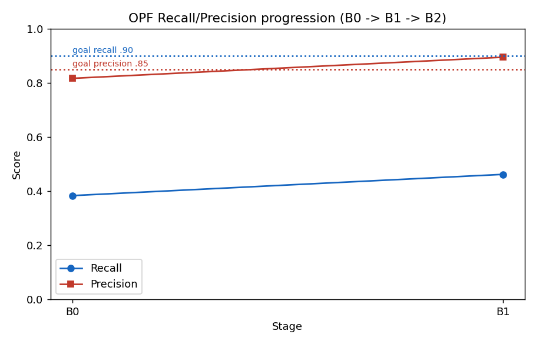

# 日本語自由記述テキストにおける OpenAI Privacy Filter の個人情報検出性能評価

対象ソフトウェア: OpenAI Privacy Filter (`opf`) [1]　|　リポジトリ: gghatano/opf-text-masking-demo　|　最終更新: 2026-06-09

> 本稿は進行中の実証実験の中間報告である。測定が完了した段階の数値のみを記載し、未実施の実験は「未測定」と明記する。現時点で素モデル評価 (B0) と後処理適用 (B1) が完了しており、追加学習 (B2)・他モデルとの本比較・業務適用シミュレーションは未実施である。

---

## Abstract

個人情報を含む自由記述テキストの利活用には、個人識別情報 (Personally Identifiable Information; PII) の検出とマスキングが不可欠だが、人手による作業負担が大きい。本研究は、OpenAI が公開したオープンウェイトの PII 検出モデル **OpenAI Privacy Filter (OPF)** [1] が、日本語の医療・自治体・その他ドメインの自由記述に対してどの程度実用的な検出性能を持つかを定量評価する。実データは用いず、ドメインごとに作成した**合成評価データ 300 文書**（医療・自治体・その他 各 100、計 1,520 スパン）を正解として用い、評価用 (test) 225 文書・調整用 (dev) 75 文書に層化分割した。検出の正否は文字単位の **IoU ≥ 0.5** によるスパン一致で判定し、見逃しと過剰検出のコストが非対称であることから、両者を統合した F 値は用いず**再現率 (Recall) と適合率 (Precision) を個別に**報告する。

評価は段階的に行う。**B0**（素の OPF）では、直接識別子に対する再現率 0.57・適合率 0.77 であり、電話番号・メール・各種 ID といった構造化された識別子はほぼ完全に検出する一方、人名 (Recall 0.38) と和暦・略記の日付 (Recall 0.29) を取りこぼした。**B1**（OPF 出力への規則ベース後処理）では、日付の正規表現補完と人名スパンの境界整形により、直接識別子の再現率 0.70・適合率 0.86 へ改善した（日付 Recall 0.29→0.99、人名の適合率 0.65→0.85）。一方、OPF が設計上対象としない準識別子（年齢・地域・職業・組織）は再現率 0 のままであり、これらは追加学習 (B2) の対象とする。本中間報告は、OPF が日本語の構造化 PII に有効である一方、人名再現率と準識別子への対応に課題が残ること、および規則ベース後処理がその一部を低コストで補えることを実数で示す。

---

## 1. はじめに

### 1.1 背景

医療記録・自治体の相談記録・コールセンター応対履歴・アンケート自由記述などでは、構造化された項目だけでなく自由記述欄に個人情報が含まれる。これらを二次利用する際には匿名加工・仮名加工が必要となり、自由記述中の PII を人手で探して加工する作業が大きな負担となっている。

近年、OpenAI がオープンウェイトの PII 検出モデル OpenAI Privacy Filter (OPF) を公開した [1]。OPF は軽量でオンプレミス実行が可能であり、匿名加工業務の省力化への応用が期待される。しかし、日本語データ、とりわけ医療・自治体分野の表現に対する性能は十分に検証されていない。

### 1.2 研究課題

本研究は以下を問う。

1. 素の OPF は日本語自由記述に対して実用的な PII 検出性能を持つか。
2. どの種類の識別子で強く、どこに弱点があるか。
3. 規則ベースの後処理や日本語データでの追加学習によって性能をどこまで改善できるか。

### 1.3 貢献

- 日本語の医療・自治体・その他ドメインを対象とした、正解ラベル付き**合成評価データ 300 文書**を構築し、生成手続きを再現可能な形で公開した。
- 統一した一致基準（文字 IoU ≥ 0.5）と再現率・適合率により、素の OPF (B0) と後処理適用 (B1) を実測し、ラベル別・ドメイン別の強み弱みを定量化した。
- 後処理が改善できる範囲と、追加学習を要する範囲（準識別子）を切り分けて示した。

---

## 2. 評価設定

### 2.1 評価データ

実データは個人情報そのものであり、評価用の正解付与自体が秘匿対象の取り扱いを伴う。そこで本研究では**合成データを既定**とする。フォーマットを定めた文書テンプレートに対し固有名詞を規則ベースで差し込み、差し込み位置から正解スパンを機械的に決定する。これにより正解ラベルが生成時に厳密に定まり、個人情報リスクも生じない。合成データの現実性が結果の外的妥当性を左右する点は限界として 5 章に述べる。

評価データは医療・自治体・その他 各 100 文書の計 **300 文書**（総スパン 1,520）からなる（生成: `scripts/00_prepare_data.py`）。各ドメインを **dev 25 / test 75** に層化分割し、後処理規則の調整は dev のみで行い、最終評価は test 225 文書に対して 1 度だけ実施する。これは調整データへの過適合による楽観的評価を避けるためである。

### 2.2 ラベル体系

検出対象を 10 種類のラベルに整理する。本人を直接特定しうる**直接識別子**6 種と、単独では特定性が低いが組み合わせで特定につながる**準識別子**4 種に分ける。

| 区分 | ラベル | 例 |
|---|---|---|
| 直接識別子 | PERSON（人名） | 山田太郎 |
| 直接識別子 | ADDRESS（住所） | 東京都千代田区1-2-3 |
| 直接識別子 | PHONE（電話番号） | 090-1234-5678 |
| 直接識別子 | EMAIL（メールアドレス） | user@example.jp |
| 直接識別子 | DATE（日付） | 2025年1月3日 / 令和7年1月3日 |
| 直接識別子 | ID（各種番号） | 患者番号・被保険者番号・会員番号 等 |
| 準識別子 | AGE（年齢） | 72歳 |
| 準識別子 | REGION（地域） | ○○市 |
| 準識別子 | OCCUPATION（職業） | 医師 |
| 準識別子 | ORGANIZATION（組織） | △△株式会社・○○病院 |

正解付与の規則（敬称はスパンに含めない／完全住所は ADDRESS・地名単独は REGION／第三者の情報も対象／病院名は ORGANIZATION／1 スパン 1 ラベル）は `docs/spec.txt` に定める。

### 2.3 評価指標

検出された区間（スパン）が正解とどの程度重なれば正解とみなすかは、文字単位の **IoU (Intersection over Union)** が 0.5 以上であることを基準とする。すなわち、予測スパンと正解スパンの文字集合について「重なりの長さ ÷ 和の長さ ≥ 0.5」のとき一致とみなす。境界が多少ずれても許容しつつ、無関係な過大検出は弾く中庸な基準である。

性能は以下で報告する。

- **再現率 (Recall)** = 正しく検出できた PII 数 ÷ 正解 PII 数。見逃しの少なさを表す。
- **適合率 (Precision)** = 正しく検出できた PII 数 ÷ 検出した総数。過剰検出の少なさを表す。

PII 検出では「見逃し（再現率の低下）」が「過剰検出（適合率の低下）」より高いリスクを持ち、両者のコストは非対称である。したがって両者を平均する F 値は用いず、再現率と適合率を**個別に**報告する。

検出は 2 つの観点で集計する。**untyped（検出）** はラベル種別を問わず位置だけを評価する観点、**typed（ラベル一致）** は位置に加えてラベルの一致も要求する観点である。OPF は後述のとおり準識別子を出力できないため、untyped は「全 10 ラベルを分母にした場合」と「直接識別子のみを分母にした場合」の両方を報告する。

### 2.4 評価モデルと段階の定義

評価対象モデルは OPF（`opf`）である。OPF の素モデルは 8 種類の固定カテゴリを出力するトークン分類器であり、そのうち本研究の直接識別子 6 種に対応づくのは人名・住所・電話・メール・日付・番号である。年齢・地域・職業・組織に相当する出力カテゴリを持たないため、これらは素モデルでは検出できない。また OPF は LoRA 等の省メモリ学習に対応せず、追加学習はフルファインチューニングで行う [2]。

性能改善を以下の 3 段階で評価する。

- **B0（素モデル）**: 配布されている OPF をそのまま適用する。
- **B1（後処理）**: OPF の出力に規則ベースの後処理（正規表現・スパン境界整形）を施す。モデル自体は再学習しない。
- **B2（追加学習）**: 日本語の合成学習データで OPF をフルファインチューニングし、10 ラベルを直接学習させる。

比較対象として日本語固有表現抽出モデル（GiNZA 等）も同一基準で評価する（3.4 節は予備実験）。

---

## 3. 結果

成功基準（目標値）は、直接識別子の再現率 90% 以上・適合率 85% 以上、業務面では作業削減率 50% 以上・見逃し率 5% 以下とする（`docs/spec.txt`）。以下の数値はすべて test 225 文書・IoU ≥ 0.5 による実測である。

### 3.1 段階別の全体性能（B0 → B1）

下表は**直接識別子の untyped 検出**（本研究の主対象）である。

| 段階 | 説明 | Recall | Precision |
|---|---|---:|---:|
| B0 | 素モデル | 0.57 | 0.77 |
| B1 | 後処理 | **0.70** | **0.86** |
| B2 | 追加学習 | 未測定 | 未測定 |

参考として、全 10 ラベルを分母とした untyped 検出では B0 が Recall 0.38 / Precision 0.82、B1 が Recall 0.46 / Precision 0.89 である。準識別子 4 種を OPF が構造的に出力できないため、全ラベル基準では再現率が構造的に低く出る。



*図1. 段階別の検出性能（全 10 ラベル untyped, test 225 文書）。点線は目標値（Recall 0.90 / Precision 0.85）。*

### 3.2 ラベル別の性能（B0 → B1）

| ラベル | B0 Recall | B1 Recall | B1 Precision | 備考 |
|---|---:|---:|---:|---|
| PHONE | 1.00 | 1.00 | 1.00 | 素モデルで飽和 |
| EMAIL | 0.86 | 0.86 | 1.00 | 素モデルで高水準 |
| ID | 0.89 | 0.89 | 0.98 | 素モデルで高水準 |
| ADDRESS | 0.81 | 0.81 | 0.48 | 境界過延長で適合率が低い |
| DATE | 0.29 | **0.99** | 0.97 | 後処理（正規表現）で大幅改善 |
| PERSON | 0.38 | 0.49 | 0.85 | 後処理で適合率 0.65→0.85、再現率は限定的改善 |
| AGE | 0.00 | 0.00 | — | OPF 対象外 → B2 |
| REGION | 0.00 | 0.00 | — | OPF 対象外 → B2 |
| OCCUPATION | 0.00 | 0.00 | — | OPF 対象外 → B2 |
| ORGANIZATION | 0.00 | 0.00 | — | OPF 対象外 → B2 |

電話番号・メール・ID といった構造化された識別子は素モデルでほぼ検出できる。一方、人名の再現率が低い点と、和暦・略記を含む日付の取りこぼしが B0 の主な弱点であった。

### 3.3 後処理 (B1) の内容と効果

B1 の後処理は **OPF 自身が出力するラベルの整形に限定**し、テンプレート固有の語彙には依存しない汎用的な日本語規則のみを用いた（実装: `scripts/05_b1_postproc.py`）。

- **日付の正規表現補完**: OPF の日付カテゴリが取りこぼす和暦（令和7年…）・略記（R7.1.18）・西暦・スラッシュ表記を正規表現で補い、既存の検出と重複しないものを追加した。これにより日付の再現率が 0.29 から 0.99 へ向上した。
- **人名スパンの境界整形**: OPF は「退院サマリ：西村千尋」や「佐藤花子（72歳）は」のように前後の文脈を巻き込んだスパンを出力することがある。先頭の「ラベル：」前置きの除去、空白区切りでの末尾要素の採用、末尾の括弧・年齢・敬称・助詞・句読点の除去により、適合率が 0.65 から 0.85 へ改善した。

人名の再現率が 0.49 にとどまるのは、OPF が 2 人目以降の人名を**そもそも検出していない**ためであり、検出されていない箇所を後処理で生成することはできない。これは素モデルの日本語人名検出能力の上限を表す。準識別子（年齢・地域・職業・組織）は OPF が出力カテゴリを持たないため後処理では補えず、追加学習 (B2) の対象とする。AGE 等への正規表現追加はモデル出力の整形を越えるため、本段階では行わない。

### 3.4 ドメイン別の性能（B0, 予備）

直接識別子の untyped 検出をドメイン別に見ると、医療 Recall 0.59・その他 0.65・自治体 0.51 であり、自治体ドメインがやや低い。

### 3.5 他モデルとの予備比較

参考として、同一の一致基準で日本語固有表現抽出モデル GiNZA を評価した予備実験（合成 15 文書の小規模パイロット、実装: `scripts/03_compare_models.py`）では、OPF が電話・メール（再現率 1.0）・ID といった構造化 PII に強く、GiNZA が人名・年齢・地域・日付といった人名系・準識別子に強いという**相補的な傾向**が確認された。ただしこれは小規模かつ準識別子が多い構成であり、本評価データ 300 文書での本比較は未実施である（3.1〜3.3 の B0/B1 数値はいずれも 300 文書由来であり、本予備比較とは規模が異なる点に注意）。


*図2. OPF と GiNZA の untyped 検出（予備実験, 合成 15 文書）。*

---

## 4. 未実施の実験

本中間報告の時点で以下は未測定である。

- **B2（日本語追加学習）**: 学習用合成データ（train 675 + 検証 75 文書、評価データと固有名詞プールを分離しリーク防止）と 10 ラベルのラベル空間定義は準備済みだが、フルファインチューニングは未実施である。これにより準識別子の検出と人名再現率の向上を狙う。
- **他モデルとの本比較**: GiNZA・Presidio・GLiNER 等を評価データ 300 文書で同一基準により比較する。
- **業務適用シミュレーション**: 検出性能を仮想業務フローに流し込み、作業削減率と見逃し率を感度分析で試算する。

---

## 5. 考察と限界

**強みと弱み.** OPF は構造化された直接識別子（電話・メール・番号）に対し、追加の工夫なしに日本語でも高い性能を示す。一方、人名の再現率が低く、和暦・略記の日付を取りこぼす。日付は汎用的な正規表現後処理でほぼ解消できるが、人名の再現率向上と準識別子への対応は素モデル＋後処理の枠を越え、追加学習を要する。

**合成データの外的妥当性.** 本評価は合成データに基づくため、実データに対する性能を直接保証しない。テンプレートと固有名詞プールに由来する表現の偏りがあり、結果は「想定した分布における上限性能」と解釈すべきである。和暦・略記・外国人氏名・部分匿名といった表記の揺れは一部混在させているが、実データとの乖離は残る。専用の難例セットによる乖離の可視化は今後の課題である。

**評価設計上の妥当性.** 一致基準・分母・調整/評価データの分離を統一し、調整は dev のみ・評価は test 1 回に限定することで、過適合による楽観的評価を避けた。後処理規則は評価データの語彙に依存しない汎用規則に限定し、自己循環的な性能水増しを避けた。

---

## 6. 結論と今後

素の OPF は日本語の構造化 PII 検出に有効である一方、人名再現率と準識別子への対応に明確な課題を持つ。規則ベースの後処理は、日付の取りこぼしと人名スパンの境界ずれを低コストで補い、直接識別子の検出を再現率 0.57→0.70・適合率 0.77→0.86 へ改善した。ただし成功基準（再現率 0.90・適合率 0.85）には未到達であり、残る差の主因は人名の非検出と準識別子の未対応である。今後はこれらを日本語追加学習 (B2) で改善し、他モデルとの本比較・業務適用シミュレーションを通じて、匿名加工業務の工数削減効果まで定量評価する。

---

## 付録A 再現手順

```bash
git clone https://github.com/gghatano/opf-text-masking-demo.git && cd opf-text-masking-demo
bash scripts/setup_env.sh && source .venv/Scripts/activate
python scripts/00_prepare_data.py            # 合成評価データ 300 文書を生成
uv run python scripts/04_b0_baseline.py      # B0: 素 OPF を test で評価
uv run python scripts/05_b1_postproc.py --split dev   # B1 後処理の調整（dev）
uv run python scripts/05_b1_postproc.py --split test  # B1 後処理の最終評価（test）
python scripts/plot_progression.py           # 図を再生成
```

数値は `outputs/metrics_ledger.csv` に追記方式で記録し、段階間の変化を追跡する。

## 付録B 手法詳細ページ

モデル個別の仕様・生データ・型対応・落とし穴・定性的所見は手法ページに分離する: [OPF](methods/opf.md) ／ [GiNZA](methods/ginza.md)（以降、Presidio・GLiNER・日本語 NER を追加予定）。

## References

- [1] OpenAI Privacy Filter. https://github.com/openai/privacy-filter
- [2] OPF CLI・学習/評価の調査メモ: [`docs/findings-opf-cli.md`](docs/findings-opf-cli.md)
- [3] 実験計画・仕様: [`docs/verification-plan.md`](docs/verification-plan.md) ／ [`docs/spec.txt`](docs/spec.txt)
