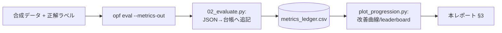
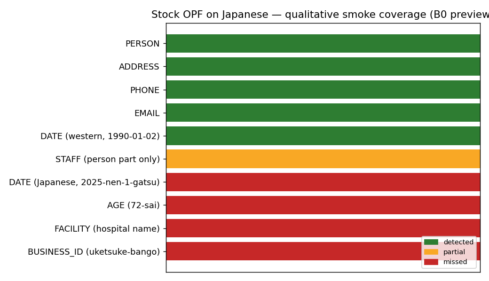

# OPF 日本語適用性 実証実験 — 評価レポート

メタ: 対象 = OpenAI Privacy Filter (`opf`) ／ リポジトリ = gghatano/opf-text-masking-demo ／ 最終更新 = 2026-06-08
実行環境 = Windows 11 / Python 3.12.12 (uv venv) / torch 2.12.0 (CPU) / opf editable

> 📑 **凡例** — `[n]` = 一次情報に基づく事実（付録C 出典）。🔎 = 筆者の実測・解釈・推定。`📘` = ドキュメント由来の事実。
> ⚠️ **本レポートは「育てる」評価レポート**です。B0→B1→B2 と実験が進むたびに §3 の数値表・図と §4 の所見を追記し、HTML を再ビルドします（運用ルールは付録B）。

> ⚠️ **スコープ** — 対象は**日本語**自由記述（医療/自治体/その他, 計300件・合成）。列をまたぐ関係や表形式は対象外。主目的は PII 検出性能（漏れ最小化）＋匿名加工**業務の工数削減効果**の定量評価。実データは扱わない。

---

## 0. エグゼクティブサマリ

- **現在地: Stage 0（環境構築・定性スモーク）完了**。`uv` で再現可能な環境を確立し、OPF が CPU 実機で動作することを確認した 🔎。
- **形式的な数値評価（B0/B1/B2）は未測定**。合成評価データ（300件, Issue #5）が揃い次第、`opf eval` → メトリクス台帳 → 改善曲線、の順で本レポート §3 を埋める。
- **定性スモークの所見** 🔎: 素の OPF は日本語でも **氏名・住所・電話・メール・西暦日付** を検出する一方、**年齢・業務ID（受付番号等）・施設名（病院名）・和暦的日付** を見逃す（図1）。これは「基本PIIは流用が効くが、仕様の業務識別子/組織/準識別子は素では出ない」という事前仮説と整合し、B1（後処理）・B2（追加学習）の伸びしろを示す。
- **重要な確定事実**: OPF は **LoRA 非対応＝フルFT のみ**（ソース確認）[\[2\]](#ref2)。評価指標は `detection.span.*` / `by_class.<label>.span.*` を台帳へ写像する [\[2\]](#ref2)。

---

## 1. 検証の目的と対象

匿名加工業務（医療・自治体の自由記述）の省力化に向け、OpenAI が公開した PII 検出モデル OPF [\[1\]](#ref1) の**日本語適用性**を評価する。素モデル性能・後処理・追加学習・他モデル比較・業務適用の各段で、主要スコアが段階的に伸びる様子を可視化する（計画: [`docs/verification-plan.md`](docs/verification-plan.md)、仕様: [`docs/spec.txt`](docs/spec.txt)）。

評価パイプライン:



---

## 2. 検証セットアップ

> 📘 OPF は双方向トークン分類＋Viterbi スパン復元の小型モデル（1.5B総/50Mアクティブ MoE, 128k ctx）[\[1\]](#ref1)。検出は固定8カテゴリ（`private_person/address/email/phone/url/date`, `account_number`, `secret`）[\[1\]](#ref1)。

| 項目 | 値 |
|---|---|
| Python / 仮想環境 | 3.12.12（`uv venv`。既定の3.14はtorch非対応）|
| 主要依存 | torch==2.12.0, tiktoken==0.13.0（`requirements.txt` 固定）|
| 実行デバイス | CPU（`--device cpu` 必須：CPU版torchはCUDA無効）🔎 |
| モデル | `openai/privacy-filter`（初回自動DL）|
| 評価データ | 合成300件（医療/自治体/その他 各100）— **作成中**（#5）|

再現は `bash scripts/setup_env.sh`（付録A）。

---

## 3. 結果サマリ（数値）

> 🔎 **現時点では B0/B1/B2 は未測定**。下表は本実証の主要スコアの記録枠で、各 Stage 完了時に台帳から転記する。成功基準 [spec §9]: Recall≥90% / Precision≥85% / 主要ラベルF1≥85% / 作業削減率≥50% / 見逃し率≤5%。

| Stage | 説明 | Precision | Recall | F1(span) | 漏れ率 | 誤検出率 |
|---|---|---:|---:|---:|---:|---:|
| B0 | 素モデル | — | — | — | — | — |
| B1 | 後処理・正規表現 | — | — | — | — | — |
| B2 | 日本語追加学習 | — | — | — | — | — |

改善曲線（台帳にデータが入ると自動描画。`python scripts/plot_progression.py`）:

<!--  ← B0 計測後に有効化 -->
*（B0 計測後に `figures/score_progression.png` を掲載）*

---

## 4. 現時点の所見（定性スモーク）

> 🔎 以下は **少数例の手動確認**であり、形式的な指標ではない（正式 B0 は §3）。素の OPF を日本語例に適用した結果。

検証例（CPU 実行、`opf --device cpu`）:

| 入力（要約） | 検出できたPII | 見逃したPII |
|---|---|---|
| 佐藤花子(72歳)・東京都千代田区・電話・受付番号A-0012 | 氏名・住所・電話 | **72歳・受付番号** |
| 山田太郎・2025年1月3日・○○病院・鈴木医師 | 山田太郎・鈴木(医師の氏名部) | **和暦的日付・病院名** |
| 田中一郎, tanaka@example.co.jp, 03-1234-5678（英混在） | 氏名・メール・電話 | — |



**図1**: 素 OPF の日本語カテゴリ別カバレッジ（定性）。緑=検出 / 橙=部分 / 赤=見逃し。

🔎 **解釈**: 基本PII（氏名/住所/電話/メール/西暦日付）は日本語でも有効。一方、仕様で要求される**業務識別子・組織(施設)・準識別子(年齢)・和暦日付**は素では落ちる。後者が B1/B2 で改善対象。英語が混在する文では検出が安定。

---

## 5. 既知の制約・落とし穴

- ⚠️ **Python 3.14 では torch ホイール無し** → `uv` で 3.12 を確保 🔎。
- ⚠️ **CPU 機は `--device cpu` 必須**（CUDA無効torchで AssertionError）🔎。
- ⚠️ `opf eval --skip-non-ascii-examples` は**日本語で使用禁止**（日本語例が全除外）[\[2\]](#ref2)。
- ⚠️ Windows コンソールは日本語出力が文字化けするが、評価は JSON/ファイル経由のため指標に影響しない 🔎。
- 📘 ラベル方針は実行時に動的変更不可。方針変更には再学習が必要 [\[1\]](#ref1)。
- 🔎 図中ラベルは日本語フォント非対応のため英語表記。

---

## 6. 次のマイルストーン

1. 合成評価データ300件＋正解ラベル（#5、方針は #4 で議論中）
2. **B0** 素モデル評価（#7）→ §3 を初回更新
3. **B1** 後処理・正規表現（#8）、GiNZA 比較（#9）
4. **B2** 18ラベル直接学習（フルFT, #12）
5. 業務適用シミュレーション（#14）→ 作業削減率/見逃し率

---

## 付録A 再現手順

```bash
git clone https://github.com/gghatano/opf-text-masking-demo.git
cd opf-text-masking-demo
bash scripts/setup_env.sh                 # uv で 3.12 venv + OPF 導入 + スモーク
source .venv/Scripts/activate             # Windows
# 評価（データ準備後）→ 台帳追記 → 図 → HTML再ビルド
python scripts/02_evaluate.py data/eval/medical.jsonl --stage B0 --model A-OPF --domain 医療
python scripts/plot_progression.py
python scripts/build_html.py
```

## 付録B レポート運用ルール（今後の実験も同形式で整理）

各実験（B0/B1/B2・モデル比較）は次の手順で**本レポートに積み増す**:

1. `02_evaluate.py` が `outputs/metrics_ledger.csv` に**追記**（履歴は上書きしない）。
2. `plot_progression.py` で `figures/score_progression.png`・`model_leaderboard.png`・`per_label_f1.png` を再生成。
3. 本 `REPORT.md` の **§3 数値表**に Stage 行を埋め、**§4 所見**に発見（特に「期待通り出なかった」事実も）を追記。
4. `build_html.py` で `htmls/` を再生成し、レビュー用に共有。
5. 事実には出典 `[n]`、実測・解釈には 🔎 を必ず付け、区別する。

> この型を崩さないことで、レビュアーは「どの数値が・いつ・どの設定で・どれだけ改善したか」を常に同じ場所で追える。

## 付録C 出典

- <a id="ref1"></a>[1] OpenAI Privacy Filter（カテゴリ・モデル・制限）: https://github.com/openai/privacy-filter
- <a id="ref2"></a>[2] OPF CLI/学習・評価 ソース確認メモ: [`docs/findings-opf-cli.md`](docs/findings-opf-cli.md)（`opf/_train/args.py`, `opf/_eval/args.py`, `opf/_eval/metrics.py`）
- <a id="ref3"></a>[3] 実証実験計画書 / 実行計画: [`docs/spec.txt`](docs/spec.txt) / [`docs/verification-plan.md`](docs/verification-plan.md)
